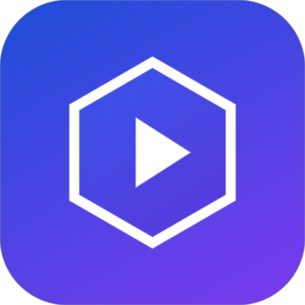
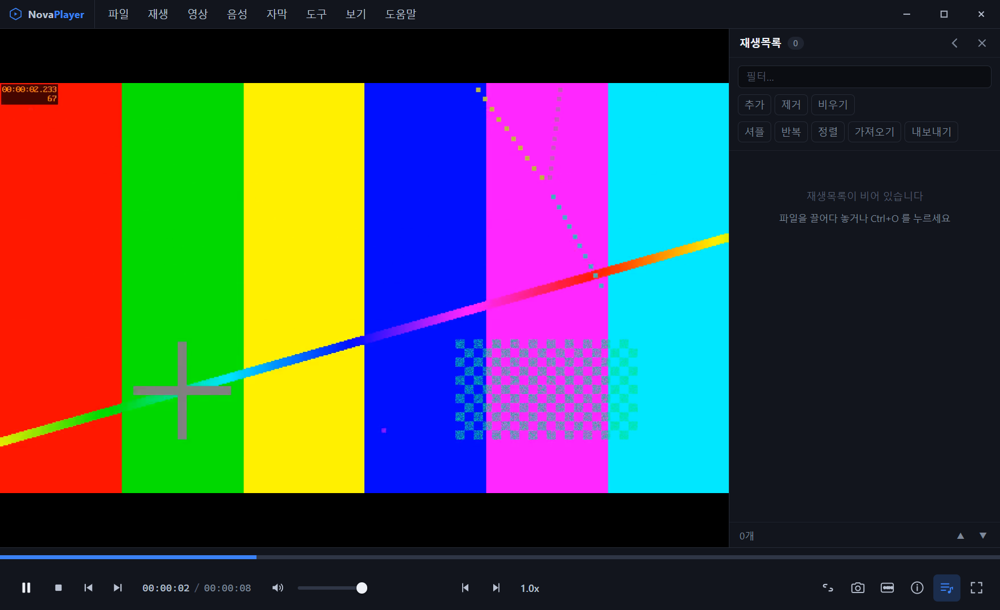

# Nova Player

[](./LICENSE)
[](https://github.com/gapfixnid/NovaPlayer/releases)
[](./package.json)

**광고도 추적도 없는 오픈소스 미디어 플레이어.**

[Download](https://github.com/gapfixnid/NovaPlayer/releases) · [Get started](#get-started) · [Shortcuts](#shortcuts) · [Privacy](#privacy) · [License](#license)



## Play anything. Tune everything. Phone home never.

| 재생 | 조정 | 프라이버시 |
|---|---|---|
| MP4 · MKV · AVI · FLV · TS · RMVB · MP3 · FLAC | 10밴드 EQ · 베이스 · 보컬 · 서라운드 | 외부 통신 차단 + CSP 이중 방어 |
| 재생 실패 시 재 mux → 실시간 트랜스코딩 자동 복구 | 밝기 · 대비 · 채도 · 감마 · 회전 · 화면비 | 사용 통계·크래시 수집 코드 자체가 없음 |
| SRT · VTT · ASS · MicroDVD, EUC-KR 자동 감지 | A-B 반복 · 프레임 이동 · 속도 · 취침 타이머 | 기록은 로컬 JSON에만 저장 |

## Get started

```powershell
cd novaplayer
npm install
npm start        # 실행
```

```powershell
npm run dist     # NSIS 설치본 + 포터블 EXE (Windows x64)
npm test         # 로직 단위 + main 스모크 테스트
npm run test:gui # 실제 구동 GUI 테스트 (재생·복구 체인·IPC·보안)
```

테스트용 샘플이 필요하면 `node assets\make-test-media.js` 로 H264/HEVC/MPEG2/FLV/VP9/10bit 영상을 생성한다.

## Shortcuts

앱 내 **도구 → 단축키 목록** 또는 **설정 → 단축키**에서 전체 목록을 확인·변경할 수 있다.

| 동작 | 키 |
|---|---|
| 재생/일시정지 | Space |
| 5초/30초/1분 탐색 | ←/→, Shift+←/→, Ctrl+←/→ |
| 볼륨/음소거 | ↑/↓, M |
| 전체화면 (영상만) | F / Enter (나가기: Esc) |
| 현재 장면 저장 | S |
| A-B 반복 | Ctrl+Alt+L |
| 자막 켜기/끄기 | B |
| 재생목록 (방향키·Enter·Delete 조작 가능) | Ctrl+L |
| 설정 | Ctrl+P |

## Privacy

- 인앱 광고·서드파티 스크립트 없음
- 앱 내부의 외부 네트워크 요청 차단 (`http/https/ws` + CSP 이중 방어, 로컬 파일은 allowlist 등록된 미디어만 서빙)
- 단, 사용자가 명시적으로 여는 외부 링크·폴더는 기본 브라우저/탐색기로 열린다
- 사용 통계·크래시 리포트 수집 없음 (관련 코드 자체가 없음)
- 재생 이력·설정은 로컬 JSON(`%APPDATA%\Nova Player`)에만 저장
- 관리자 권한 요구 없음

## License

[MIT](./LICENSE). Chromium·ffmpeg의 각 라이선스를 따른다.
